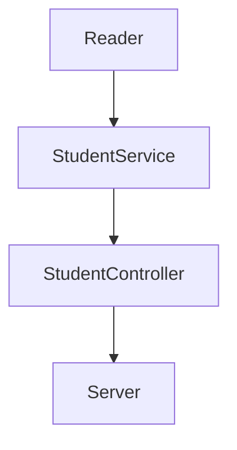

<div id="top"></div>

[![Contributors][contributors-shield]][contributors-url]
[![Forks][forks-shield]][forks-url]
[![Stargazers][stars-shield]][stars-url]
[![Issues][issues-shield]][issues-url]

<!-- PROJECT LOGO -->
<br />
<div align="center">
  <a href="https://github.com/JavierMendez-Coder/visual-thinking-api">
    
  </a>

<h3 align="center">Visual Thinking API</h3>

  <p align="center">
    Practice API project to access to the Visual Partner-Ship students
    <br />
    <a href="https://github.com/JavierMendez-Coder/visual-thinking-api"><strong>Explore the docs »</strong></a>
    <br />
    <br />
    <a href="https://github.com/JavierMendez-Coder/visual-thinking-api/issues">Report Bug</a>
    ·
    <a href="https://github.com/JavierMendez-Coder/visual-thinking-api/issues">Request Feature</a>
  </p>
</div>

<!-- TABLE OF CONTENTS -->
<details>
  <summary>Table of Contents</summary>
  <ol>
    <li>
      <a href="#about-the-project">About The Project</a>
      <ul>
        <li><a href="#built-with">Built With</a></li>
      </ul>
    </li>
    <li>
      <a href="#getting-started">Getting Started</a>
      <ul>
        <li><a href="#prerequisites">Prerequisites</a></li>
        <li><a href="#installation">Installation</a></li>
      </ul>
    </li>
    <li><a href="#usage">Usage</a></li>
    <li><a href="#roadmap">Roadmap</a></li>
    <li><a href="#contributing">Contributing</a></li>
    <li><a href="#license">License</a></li>
    <li><a href="#contact">Contact</a></li>
    <li><a href="#acknowledgments">Acknowledgments</a></li>
  </ol>
</details>

<!-- ABOUT THE PROJECT -->

## About The Project

Challenge project from Launch X's backend course designed by Carlo Gilmar, to put into practice the knowledge gathered through the live sessions and exercises.



- `Reader`: interprets the JSON format database file.
- `StudentService`: Fulfills students requirements.
- `StudentController`: Forwards requests from the server to their respective service.
- `Server`: Responds to http requests.

<p align="right">(<a href="#top">back to top</a>)</p>


### Built With

- [JavaScript](https://www.javascript.com)
- [Node](https://nodejs.org)
- [Jest](https://jestjs.io)
- [Express](https//expressjs.com)
- [ESLint](https://eslint.org)

### Why this dependencies?

| Dependencies | Used to                          |
| :----------: | -------------------------------- |
| Jest         | Drive unit tests                 |
| Express      | Create the backend app API       |
| ESLint       | Take care of the code legibility |

<p align="right">(<a href="#top">back to top</a>)</p>


<!-- GETTING STARTED -->

## Getting Started

To get a local copy up and running follow these steps.

### Prerequisites

- npm
  ```sh
  npm install npm@latest -g
  ```

### Installation

1. Clone the repo
   ```sh
   git clone https://github.com/JavierMendez-Coder/visual-thinking-api.git
   ```
2. Install NPM packages
   ```sh
   npm install
   ```

<p align="right">(<a href="#top">back to top</a>)</p>

<!-- USAGE EXAMPLES -->

## Usage

This API allows you to access to the students database in JSON format from Visual Partner-Ship. You can access it via browser or API platforms like [Postman][postman-url].

### HTTP Requests examples

- Obtain the students list
  ```http
  GET localhost:3000/v1/students
  ```
- Obtain the emails list of the certified students
  ```http
  GET localhost:3000/v1/students/certified
  ```
- Obtain the students list whose credits exceeds 500
  ```http
  GET localhost:3000/v1/students/credits
  ```

<p align="right">(<a href="#top">back to top</a>)</p>

<!-- ROADMAP -->

## Requirements Roadmap

- [x] Enable an endpoint to query all the students with all their fields
- [x] Enable an endpoint to query emails of every students whose have a certification
- [x] Enable an endpoint to query all the students which have credits over 500

<p align="right">(<a href="#top">back to top</a>)</p>

<!-- CONTACT -->

## Contact

Javier Méndez - javiermendez0299@gmail.com.com

Project Link: [https://github.com/JavierMendez-Coder/visual-thinking-api](https://github.com/JavierMendez-Coder/visual-thinking-api)

<p align="right">(<a href="#top">back to top</a>)</p>

<!-- ACKNOWLEDGMENTS -->

## Acknowledgments

- [Launch X](https://github.com/LaunchX-InnovaccionVirtual)
- [Carlo Gilmar](https://github.com/carlogilmar/)
- [Visual Partner-Ship](https://github.com/visualpartnership)

<p align="right">(<a href="#top">back to top</a>)</p>

<!-- MARKDOWN LINKS & IMAGES -->
<!-- https://www.markdownguide.org/basic-syntax/#reference-style-links -->

[contributors-shield]: https://img.shields.io/github/contributors/JavierMendez-Coder/visual-thinking-api.svg?style=for-the-badge
[contributors-url]: https://github.com/JavierMendez-Coder/visual-thinking-api/graphs/contributors
[forks-shield]: https://img.shields.io/github/forks/JavierMendez-Coder/visual-thinking-api.svg?style=for-the-badge
[forks-url]: https://github.com/JavierMendez-Coder/visual-thinking-api/network/members
[stars-shield]: https://img.shields.io/github/stars/JavierMendez-Coder/visual-thinking-api.svg?style=for-the-badge
[stars-url]: https://github.com/JavierMendez-Coder/visual-thinking-api/stargazers
[issues-shield]: https://img.shields.io/github/issues/JavierMendez-Coder/visual-thinking-api.svg?style=for-the-badge
[issues-url]: https://github.com/JavierMendez-Coder/visual-thinking-api/issues
[postman-url]: https://www.postman.com/
